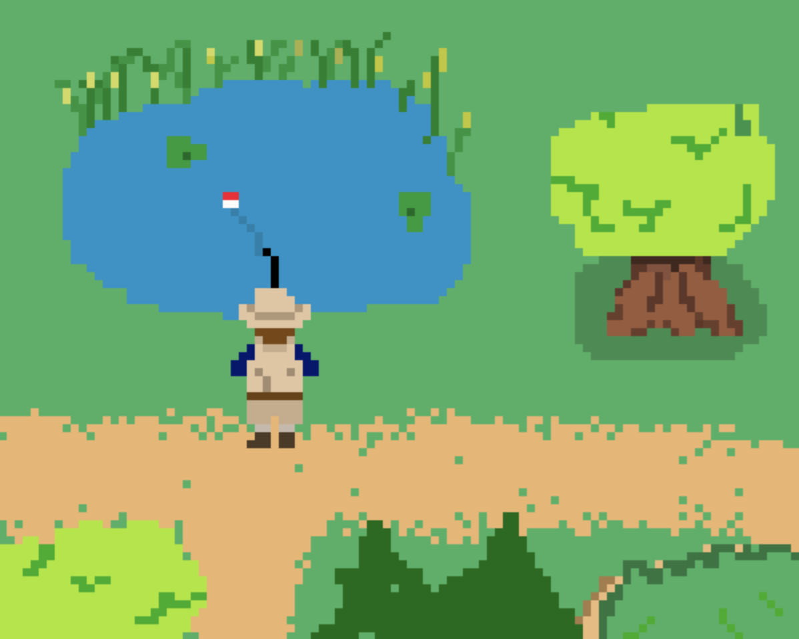
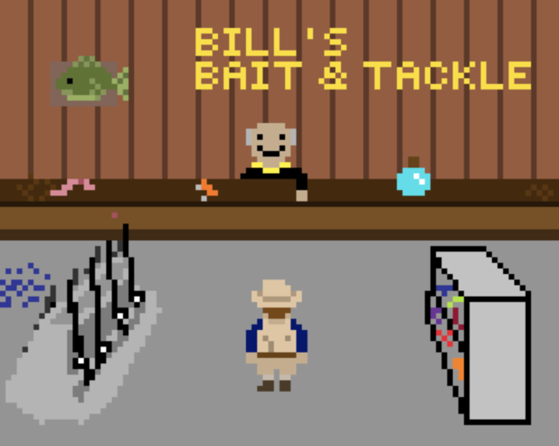
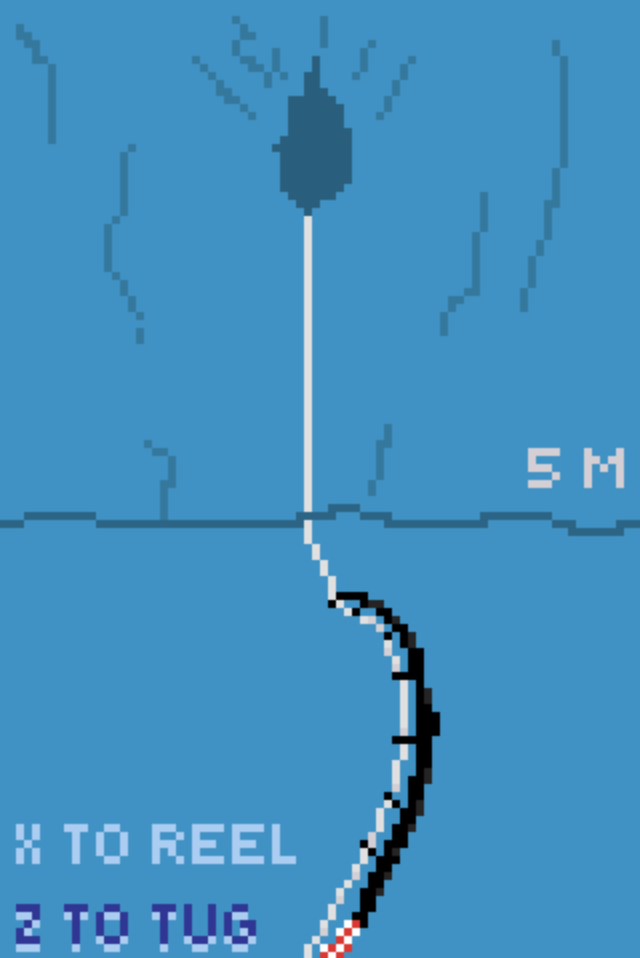

# Fishing Game!

by fishing game

## Team Members
* Advanced Topic Subteam 1: Physics/Fluid Dynamics
	* Cole Metrick
	* Ken Barrett
	* Jason Ye
	* Dheyab Alshehh

* Advanced Topic Subteam 2: Bayesian Networks
	* Ben Gradeck
	* Jackie Colmenares
	* Apostoli Karpouzis
	* Corey Medve

## Game Description

DESCRIPTIONHERE

## Advanced Topic Description

### Advanced Physics/Fluid Dynamics

Since our game is primarly played with a top down view, the physics will focus on the x and y axis with some z axis calculations for the baits (i.e. surface baits vs underwater baits). The translational and rotational motion of the fish will be calculated based on player actions, fish characteristics, and fishing rod characteristics. Fluid-dynamic drag will factor into the motion. Projectile motion will be incorpoated for lure casting based on the lure weight and rod strength. The tensile strength of the fishing rod and line will be taken into account for visuals and line snapping. For example, the rod will bend more when there is more tension on the line. Environmental factors like water currents and debris will affect tension on the line and increase drag.
    
### Bayesian Networks (AI)

DESCRIPTIONHERE

## Midterm Goals

### General

### Physics
* Calculate fish drag force
  * Physical characteristics
    * Mass
    * Size
    * Shape
  * Motion
    * Velocity
    * Rotation
* Calculate force exerted by fish
   * Strength
   * Aggressiveness
* Implement player-fish-rod interaction
   * Reeling
   * Orientation of player and fish
    
### Bayesian Networks
* Create one fishing environment
  * Defined model for introduction and removal of fish into environment
  * Incorporate time of day and weather into environment's model/fish spawn probability
* Create two different fish types
  * Bayesian network for activity of the fish types
  * Take time of day, water depth, and weather into account for Bayesian networks (with fixed values for each)

## Final Goals

### General

### Physics (20% total)
* Fishing rod (6%)
  * Line breaking
  * Rod bending
* Lure (6%)
  * Weight
  * Size
* Water current (4%)
* Debris (4%)

### Bayesian Networks (20%)
* 3 different fishing enviroments (5%)
* 5 different types of fish (5%)
* Implementation of day/night cycle (5%)
  * Look / lighting in the world changes based off of the time of day
  * The fish able to be caught and the activity of the enviroments differ on the time of day
* Implement weather cycle (5%)
  * Different regions of the map can have different weather at the same time
  * Weather can change throughout the day

## Stretch Goals

* GOAL1HERE
* GOAL2HERE
